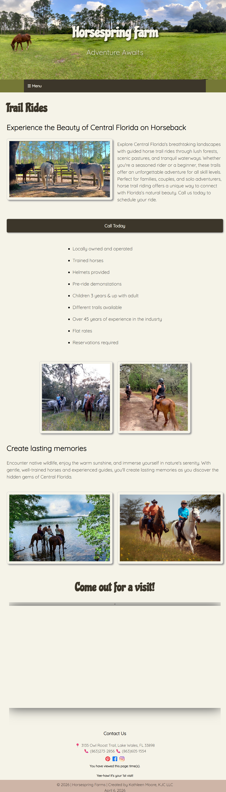
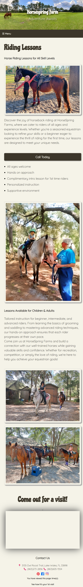

# Horse Spring Farms Website

This project is a full website I designed and developed for Horse Spring Farms, focused on creating a visually engaging and user-friendly experience for a real-world business.

## 🎨 Design Approach
The design focuses on clean layouts, natural flow, and a welcoming aesthetic that reflects the environment of a horse riding facility.

- Structured layouts to guide user navigation
- Balanced use of imagery and whitespace
- Clear visual hierarchy for readability
- Consistent styling across pages

## 🔧 Technologies Used
- HTML
- CSS
- JavaScript

## 💡 Project Highlights
- Designed for real users and business needs
- Built responsive layouts for multiple screen sizes
- Focused on intuitive navigation and usability
- Organized code structure for scalability

## 🚀 What I Learned
- How to translate a real business into a functional website
- Connecting visual design with user experience
- Building complete front-end systems from scratch
- Making design decisions that improve usability

## 📁 Project Status
The live site is no longer active, but the full project and code are available here for review.

## 📸 Screenshots

### Homepage

### Trail Ride Page

### Lessons Page

